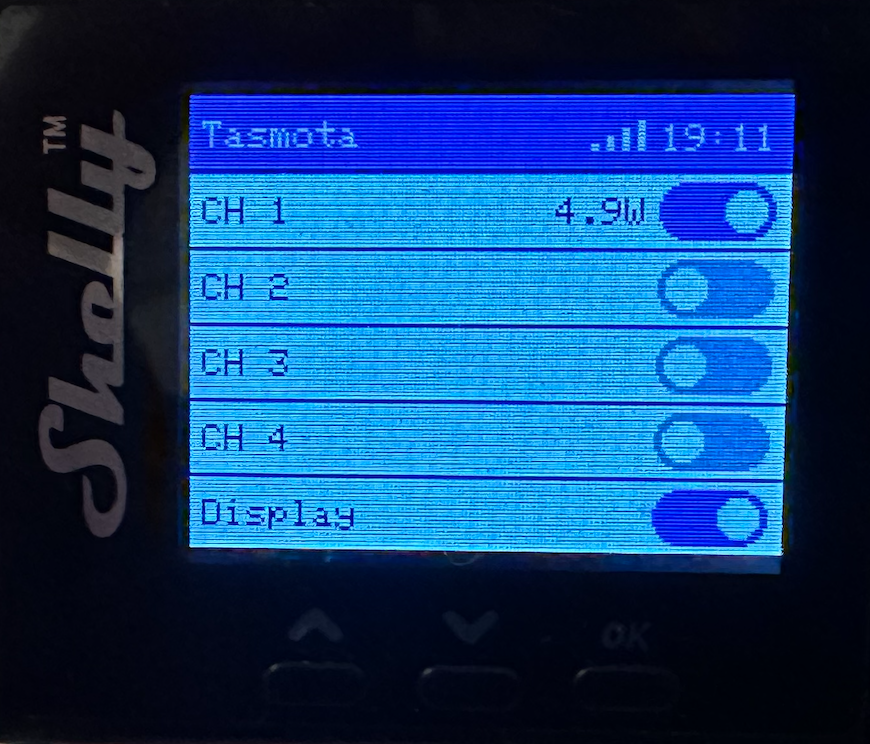

# Shelly Pro 4PM 
Basic UI for Shelly Pro 4PM flashed with Tasmota 
<div>

</div>

## Features
- Device and Relay names are configurable in the Configuration / Configure Other menu (Device / Friendly Name 1-5)
- If nothing configured (all are set to "Tasmota" by default) Relays 1-4 will be named "CH 1-5" and Relay 5 will be named "Display"
- When a relay is switched on the active power is shown and updated each second
- WiFi quality is measured each 10s and shown once a minute
- The time is updated each minute
  
## Installation
Tasmota appication (.tapp) will be build automatically for each relase. You can download the file under Actions / Release Build

To create the file manually execute following in the repo directory
```
rm -f ShellyPro4PM.tapp; zip -j -0 ShellyPro4PM.tapp src/*
```
